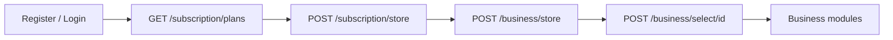

# End-User Architecture

How subscriptions, business profiles, and API access work for **end users** on the main API (`routes/api.php`).

For platform admin and white label flows, see [../admin-docs/architecture.md](../admin-docs/architecture.md).

---

## User model

| Role | Main API access | Business profiles | Wallet | Subscription |
|------|-----------------|-------------------|--------|--------------|
| `user` | Yes | Creates own | No | User subscription (feature quotas) |
| `user_staff` | Yes (inherits parent) | Uses parent's | No | Inherits parent |

Admin and white label accounts use the **admin subdomain** only — they are blocked by `user.only` middleware on the main API.

---

## Subscription vs business

```text
user (subscription on users.id)
  ├── business_profile 1  → ledgers, items, projects, …
  ├── business_profile 2
  └── user_staff (inherits subscription limits)
```

- **Subscription** controls feature quotas and gates business-scoped modules.
- **Business profile** scopes accounting data (ledgers, items, projects, sites).
- Feature usage is counted **across all businesses** owned by the user.

---

## Typical onboarding



1. Authenticate on `{APP_DOMAIN}/api/auth/*`
2. Activate a subscription plan
3. Create at least one business profile
4. Select the active business before calling settings, ledgers, items, etc.

---

## Middleware stack

| Route group | Middleware |
|-------------|------------|
| Splash | `optional.sanctum`, `account.active` |
| Auth (protected) | `auth:sanctum`, `account.active` |
| Business, staff, subscription, payment | + `user.only` |
| Staff / module routes | + `user.check.permission:{module.action}` |
| Settings, ledgers, items, transactions, projects, sites | + `business.selected`, `subscription.active` |

`POST /business/store` and `POST /staff/store` additionally require `subscription.active`. Creating records is also quota-checked against live usage counts for: `business`, `staff`, `project`, `site`, `item`, `ledger`, `invoice`, `transaction`. An expired plan is persisted on the next gated request (`subscription_expired`). Inactive users (or staff whose parent is inactive) receive `account_inactive` and all Sanctum tokens are revoked.

---

## Staff inheritance

`user_staff` accounts:

- Use the parent's subscription for plan limits and `/subscription/*` responses
- Operate under businesses owned by the parent user
- Are gated by assigned `user` scope permissions (`GET /splash`, [permissions.md](./permissions.md))
- Are managed via [staff.md](./staff.md)

---

## Related docs

- [subscription.md](./subscription.md) — plan listing, activation, usage
- [business.md](./business.md) — business profile CRUD and selection
- [../admin-docs/README.md](../admin-docs/README.md) — admin subdomain APIs
